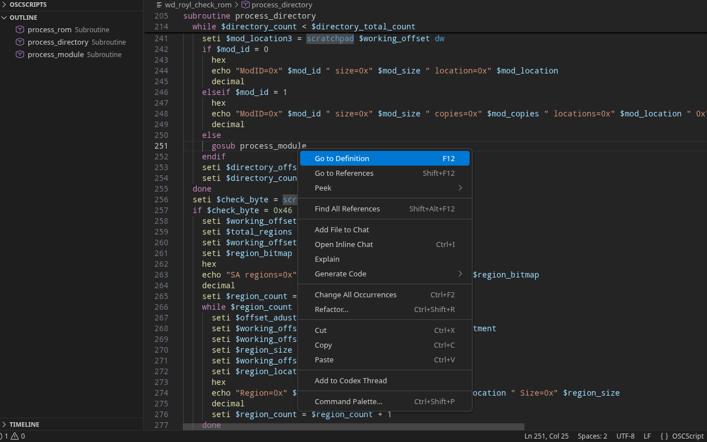

<h1 align="center">
   
  OpenSuperClone Language Support for Visual Studio Code
   
</h1>

<h4 align="center">
  A quickly made, simple language support extension for the script language used in <a href="https://github.com/ISpillMyDrink/OpenSuperClone">OpenSuperClone</a> and <a href="https://www.hddsuperclone.com/">HDDSuperClone</a>
</h4>

  

